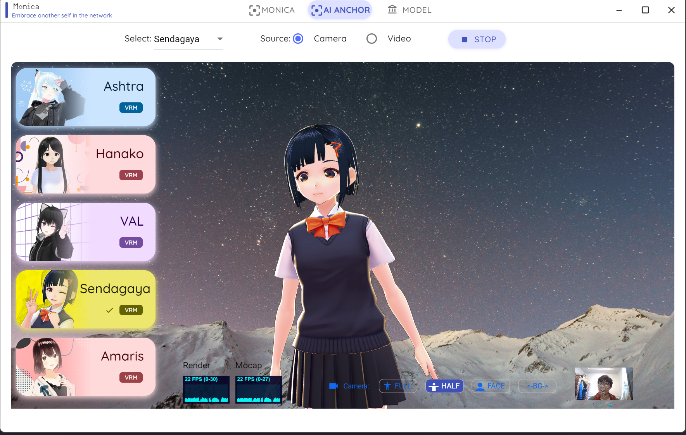
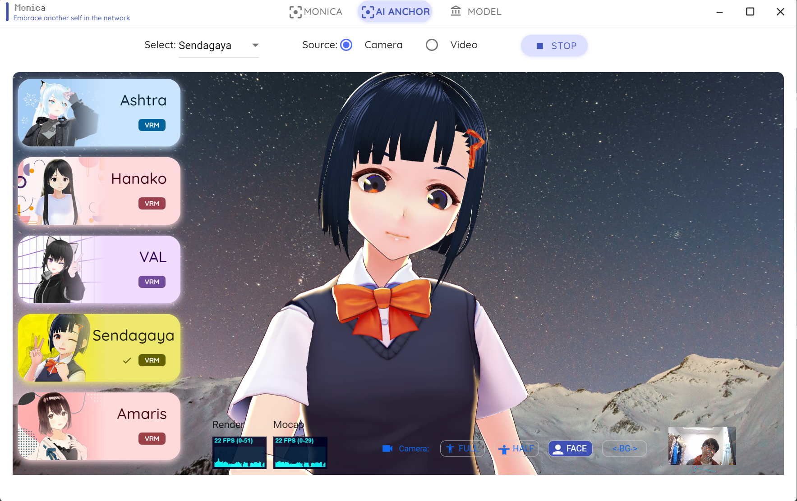
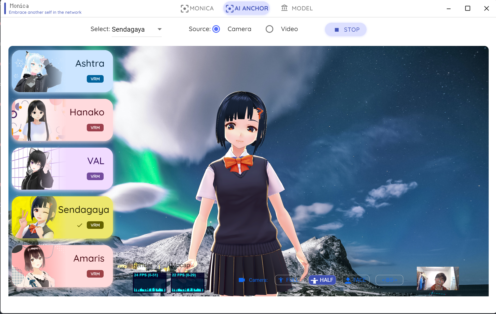
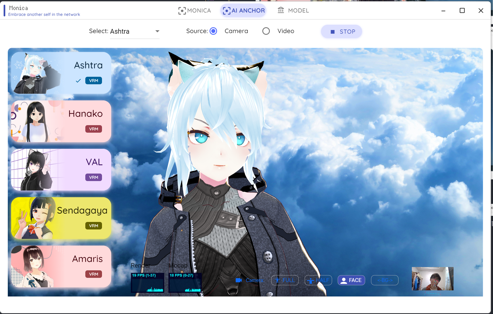

# Monica: an amazing virtual anchor

## Introduction

Monica, named after a character in my favorite show "Friends", is a stunning virtual anchor system. She is another self in the online world, please embrace her! If you are afraid to show your face, you can use it anywhere, such as live streaming, lecturing, various video conferences, etc. I have a nice idea. For online classes, opening the video would be an invasion of privacy, but with Monica, the teacher can indirectly see what each student is listening to, or at least make sure the students are looking at the screen.

## Technologies
- [MediaPipe](https://google.github.io/mediapipe/): Face Detection, Face Mesh, Iris Detection, Hand Detection, Pose Detection, Holistic Detection
- [Electron](https://www.electronjs.org/): Build cross-platform desktop apps with JavaScript, HTML, and CSS
- [kalidokit](https://github.com/yeemachine/kalidokit): Kalidokit is a blendshape and kinematics solver for Mediapipe/Tensorflow.js face, eyes, pose, and hand tracking models, compatible with Facemesh, Blazepose, Handpose, and Holistic. It takes predicted 3D landmarks and calculates simple euler rotations and blendshape face values.
- Reference: [vtuber](https://github.com/YunYouJun/vtuber),  [Amazing_MediaPipe_Tools](https://github.com/lif314/Amazing_MediaPipe_Tools),  [Material Design](https://m3.material.io/)

## How to run 

- install
```shell
npm i
```

- install electron
```shell
 cd .\node_modules\electron\

 node install install.js
```

- run

```shell
npm start
```


## What you can see
- AI Anchor(Half mode)



- AI Anchor(Face mode)



- AI Anchor(change background)



- AI Anchor(change model)




- Model library


